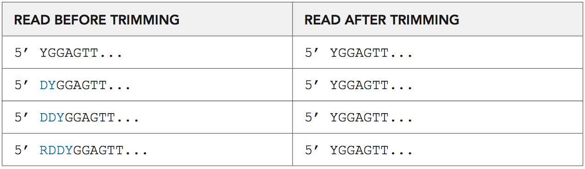
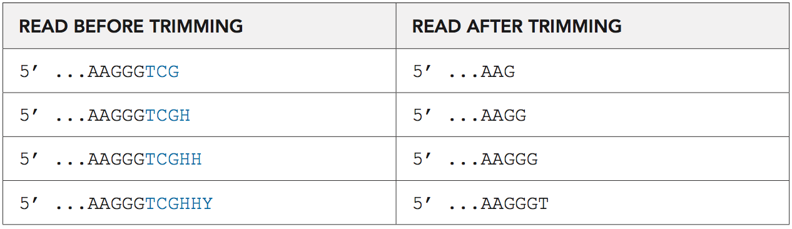
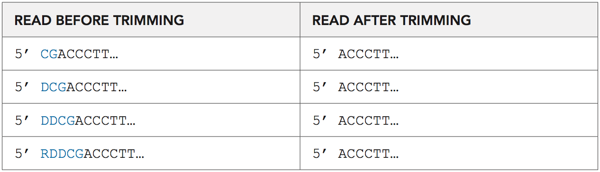
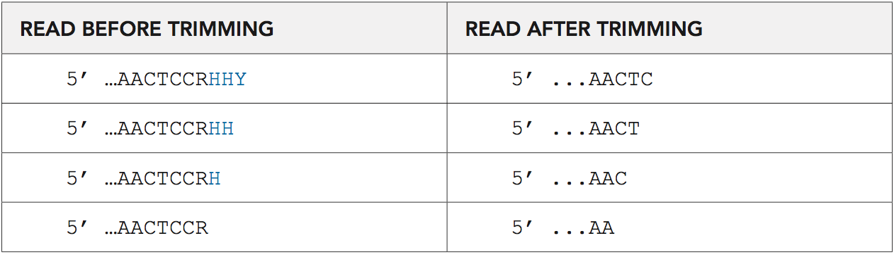

# Analysis Guide for Tecan RRBS Methyl-Seq

The Ovation RRBS Methyl-Seq System generates libraries compatible with Illumina sequencing platforms.
 After parsing the data by sample index, libraries must be trimmed prior to alignment as described below to remove
 adaptor sequence, low quality reads, and diversity bases. Ensure you have installed the most current version
 of [Trim Galore](https://www.bioinformatics.babraham.ac.uk/projects/trim_galore/), [Bismark](https://www.bioinformatics.babraham.ac.uk/projects/bismark/Bismark_User_Guide.pdf), [Bowtie2](http://bowtie-bio.sourceforge.net/bowtie2/index.shtml), and [Samtools](http://samtools.sourceforge.net/) prior to data analysis. Additional scripts used for data
 analysis are available through Tecan NGS Technical Support techserv-gn@tecan.com. Optional de-duplication can be performed
 after alignment to the reference genome following the instructions below.

## Adaptor and Quality Trimming

To accurately identify the diversity sequence and `MspI` - `(C^CGG)` - site it is important to first trim any adaptor
 sequence that may be present on the 3’ end of your reads. [Trim Galore](www.bioinformatics.babraham.ac.uk/projects/trim_galore/)
 works well for this purpose. Trim Galore will also trim some or all of a read due to low quality.
 
 Run the program with default parameters and do not use the `--rrbs` option.

### Single-end:

```
trim_galore -a AGATCGGAAGAGC R1.FQ
```

### Paired-end:

```
trim_galore --paired -a AGATCGGAAGAGC -a2 AAATCAAAAAAAC R1.FQ R2.FQ
```

## Diversity Trimming and Filtering with diversity trimming scripts.

Following adaptor and quality trimming and prior to alignment, the additional sequence added by the diversity adaptors
 must be removed from the data. This trimming is performed by a custom python script [`trimRRBSdiversityAdaptCustomers.py`](./trimRRBSdiversityAdaptCustomers.py) provided by Tecan in this repository.
 The script removes any reads that do not contain an MspI site signature `YGG` at the 5’ end.
 For paired end data an MspI site signature is required at the 5’ end of both sequences.
 The script accepts as input one or two fastq file strings, given either as complete filenames or as a pattern in
 quotes. When a pattern is given, the script will find all the filenames matching a specified pattern according to
 the rules used by the Unix shell `(*,?)`. You may access the help option of this script for more details `-h`.


Example usage for single end reads after adaptor and quality trimming with a complete filename:

```
python trimRRBSdiversityAdaptCustomers.py -1 sample_R1.fq
```

with a pattern:

```
python trimRRBSdiversityAdaptCustomers.py -1 '*R1.fq'
```

Example usage for paired-end reads after adaptor and quality trimming with a complete filename:

```
python trimRRBSdiversityAdaptCustomers.py -1 sample_R1.fq -2 sample_R2.fq
```

with a pattern:

```
python trimRRBSdiversityAdaptCustomers.py -1 '*R1.fq' -2 ‘*R2.fq’
```

The script will generate new file(s) with `_trimmed.fq` appended to the filename.
 The reads will have been trimmed at the 5’ end to remove the diversity sequence (0–3 bases), and all reads should
 begin with `YGG`, where `Y` is `C` or `T`. On the 3’ end, 5 bases are trimmed from every read
 (6 bases are trimmed for paired-end to prevent alignment issues).

The trimmed fastq file should be used for downstream analysis including `bismark`.


## Alignment to Genome

After trimming, the data can be aligned to the genome of interest. 
 [Bismark](http://www.bioinformatics.babraham.ac.uk/projects/bismark/) is a tool that aligns bisulfite converted
 sequencing reads to the genome and also performs methylation calls in the same step.
 The program supports single and paired-end reads and both ungapped and gapped alignments.

### To align single end reads:

```
bismark --bowtie2 /location/bismark/genome/ R1_trimmed.FQ
```

### For paired-end reads:

```
bismark --bowtie2 /location/bismark/genome/ -1 R1_trimmed.FQ -2 R2_trimmed.FQ
```

Note: Recent versions of Bismark automatically generate a BAM file instead of a SAM file.
 In order to perform the optional duplicate determination step, the resulting BAM file must be converted to a SAM file,
 or else run Bismark with option `--sam`. Continue with downstream data analysis or to unique molecule identification
 as described in the following section.

## Duplicate Determination with NuDup (Optional):
The N6 molecular tag is a novel approach to the unambiguous identification of unique molecules.
 Traditionally, PCR duplicates are identified in libraries made from randomly fragmented inserts by mapping inserts to
 the genome and discarding any paired end reads that share the same genomic coordinates. This approach doesn’t work for
 restriction digested samples, such as RRBS, because all fragments mapping to a genomic location will share the same
 ends. The Duplicate Marking tool utilizes information provided by the unique N6 sequence to discriminate between true
 PCR duplicates and independent adaptor ligation events to fragments with the same start site resulting in the
 recovery of more usable data. 

Bismark modifies read names in its output and NuDup requires that the read names in the alignment and index files match exactly.
 The `strip_bismark_sam.sh` script is provided to strip the read name changes that happen in bismark.
 Bismark output files must be modified for input into NuDup using the following command:

```
strip_bismark_sam.sh bismarkout.sam
```

Note: Recent versions of Bismark automatically generate a BAM file instead of a SAM file.
 In order to use the stripping tool, the resulting BAM file must be converted to a SAM file,
 or else run Bismark with option `--sam`

Next, run NuDup using the modified SAM files as input:

For single end reads:

```
python nudup.py –f index.fq –o outputname bismarkout.sam_stripped.sam
```

For paired-end reads:

```
python nudup.py –2 –f index.fq –o outputname bismarkout_stripped.sam
```

Continue with downstream data analysis.

Note: These commands assume that a 12-base index read was generated. If longer index reads were generated, contact Tecan NGS Technical Support techserv-gn@tecan.com.

## Diversity Trimming Examples

### Examples of Trimming the 5’ Ends of Forward Reads

In this example, the fragment was derived from the genomic sequence, starting and ending with MspI sites:

```
5’ CCGGAGTT … AAGGGCCGG 3’
3’ GGCCTCAA … TTCCCGGCC 5’
```

After MspI digestion:


```
5’ CGGAGTT…AAGGGC 3’
3’ CTCAA…TTCCCGGC 5’
```

After ligation to adaptors, both with three bases of diversity. Bases in blue denote sequence derived from the adaptor:


After bisulfite conversion and PCR amplification of the top strand:


Assuming the insert is smaller than the read length, the forward read after Trim Galore
is used to trim the adaptor from the 3’ end will be:


The result of the diversity trim of the forward read (if it's a single-end read)
will be:

```
5’ YGGAGTT…AAGGGT 3’
```

The reverse read after Trim Galore is used will be:


The result of the diversity trim of the reverse read:
```
5’ ACCCTT…AACT 3’
```

The adaptor can contain between 0 and 3 bases of diversity.

Tables 1-4 show how the script trims all types of adaptor variation.


*Table 1:  Trimming of the 5’ ends of forward reads*



*Table 2: Trimming of the 3’ ends of forward reads*



*Table 3: Trimming of the 5’ ends of reverse reads*



*Table 4: Trimming of the 3’ ends of reverse reads*



## Effects of Read Length on Mapping Rate

The following data illustrates how read length affects mapping rates.
 An Ovation RRBS Methyl-Seq System library was prepared from IMR90 cell line DNA and sequenced on a HiSeq2500 in
 Rapid Run mode using 2X 100 nt paired end reads. The raw data was used in full, or trimmed as indicated, before
 processing first with [Trim Galore](www.bioinformatics.babraham.ac.uk/projects/trim_galore/) to remove adaptor
 sequence and low quality bases, and then with the diversity trimming script.
 The resulting reads were then mapped to the hg19 human genome reference using
 [Bismark](www.bioinformatics.bbsrc.ac.uk/projects/bismark/).


*Table 14 displays the percent of reads mapping uniquely and non-uniquely for single end reads of various lengths.*

| SINGLE END LENGTH              | 29nt    | 36nt   | 50nt   | 75nt   | 100nt  |
|--------------------------------|---------|--------|--------|--------|--------|
| Sequences mapping uniquely     | 18.70%  | 51.20% | 57.80% | 64.80% | 67.30% |
| Sequences mapping non-uniquely | 81.30%  | 47.40% | 37.80% | 28.00% | 23.50% |
| Total                          | 100.00% | 98.60% | 95.60% | 92.80% | 90.80% |


*Table 15 presents the same metrics for paired end reads.*

| SINGLE END READ LENGTH         | 2x29nt | 2x36nt | 2x50nt | 2x75nt | 2x100nt |
|--------------------------------|--------|--------|--------|--------|---------|
| Sequence mapping uniquely      | 57.50% | 64.60% | 66.70% | 68.00% | 67.60%  |
| Sequences mapping non-uniquely | 29.30% | 25.50% | 20.20% | 17.80% | 17.40%  |
| Total                          | 86.80% | 90.10% | 86.90% | 85.80% | 85.00%  |

29 nt and 36 nt reads are shown to enable comparison to published RRBS data (29 nt single end reads — [Boyle, et al. (2012) (Genome Biol 13:R92)](https://genomebiology.biomedcentral.com/articles/10.1186/gb-2012-13-10-r92). 36nt single end reads — [Varley, et al. (2013) (Genome Res 23:555)](http://genome.cshlp.org/content/23/3/555.abstract).

While some reports use modified reference genomes to reflect only expected `MspI` fragments for mapping, for this analysis reads were mapped to the entire, unmodified human reference genome.

In addition to mappability, you may also want to consider how read length affects `CpG` loci coverage. Many `MspI` fragments contain internal `CpG`'s, so longer reads will sequence more `CpG`s. However, many `MspI` fragments are smaller than 100 bp, and even smaller than 50 bp. For these fragments, long sequencing reads, or paired end reads, provide no additional `CpG` data.

